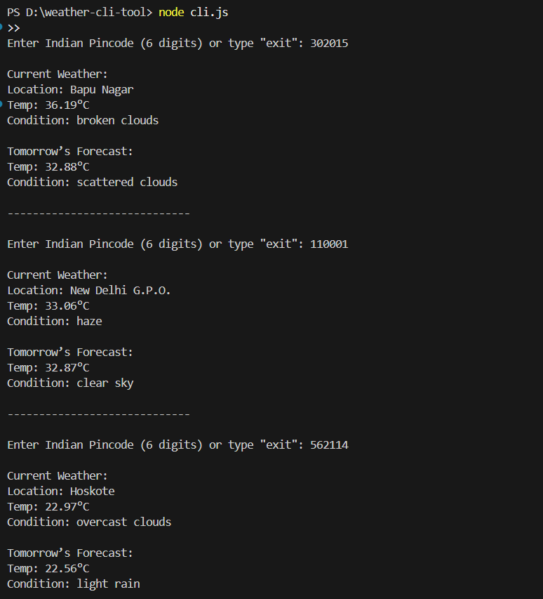
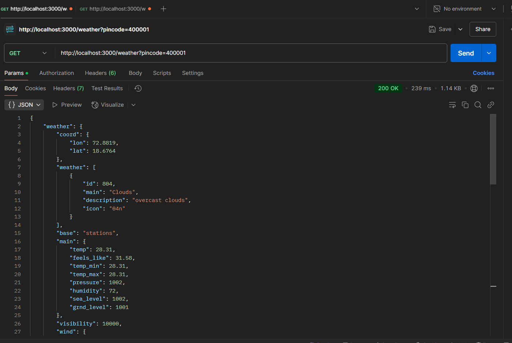
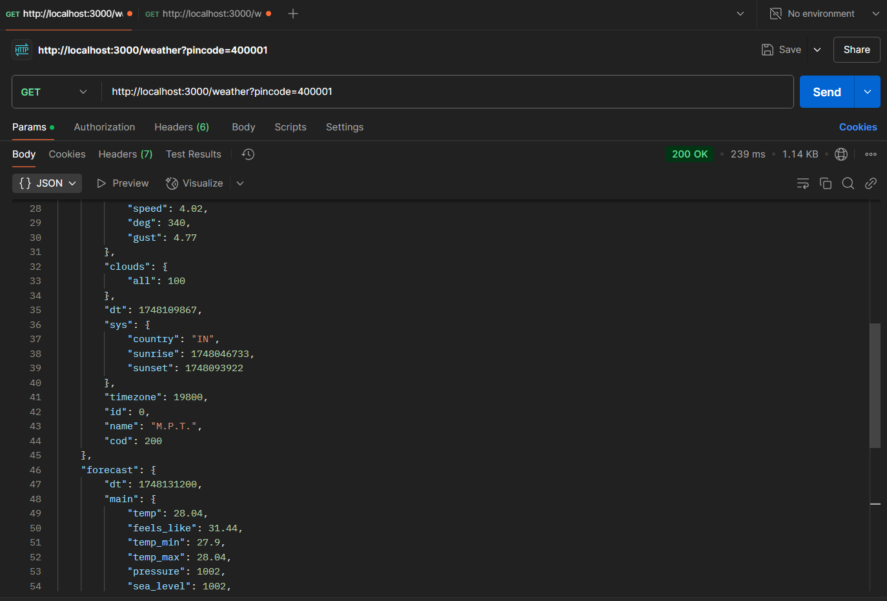
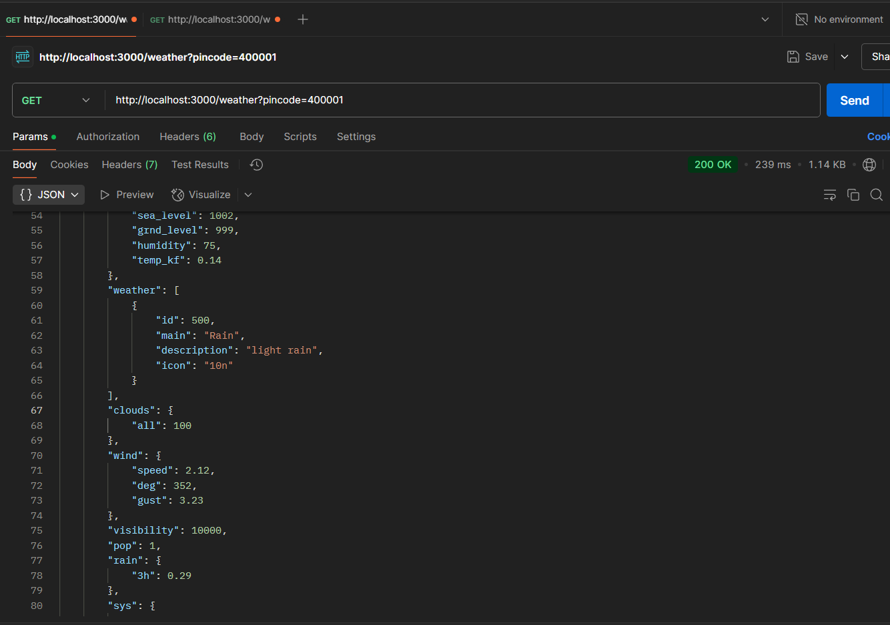
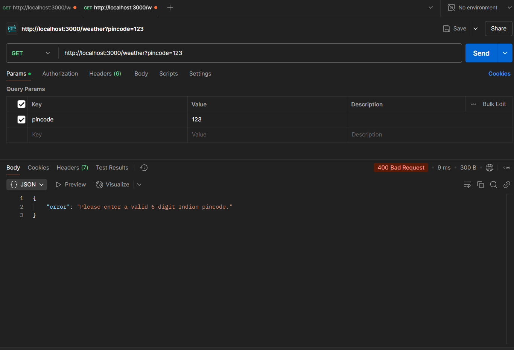

# Weather CLI Tool (India - Pincode Based)

A robust and user-friendly command-line tool built in **Node.js** that fetches the **current weather** and **next day forecast** for any location in India based on **pincode input**. This tool uses the OpenWeatherMap API and includes caching, error handling, and a continuous input loop. An optional server mode is also available for multi-client support.

---

## Why Choose Pincode Instead of City Name?

When developing the command line weather tool, we chose to use the pincode as the primary input instead of the city name because **pincodes offer greater accuracy and simplicity**. In India, many cities share the same name, and city names can often be spelled or formatted in multiple ways, such as "Delhi," "delhi," "New Delhi," or "delhi NCR." This variability makes it difficult to consistently and reliably fetch weather data based on city names.

On the other hand, pincodes are **unique six-digit numerical codes** assigned to specific geographic areas, which eliminates ambiguity. Additionally, the OpenWeatherMap API supports querying weather data directly using pincodes in the format `zip={pincode},IN`, making it straightforward to implement. Validating pincodes is also simpler, requiring only a check for a six-digit number, which improves the robustness of the application.

**In summary**, using pincodes reduces errors, simplifies input processing, and ensures that users receive accurate weather information for their intended locations.

---

## Features

- Input: Indian **Pincode**
- Output: 
  - **Current Weather**
  - **Next Day Forecast**
- Robust input parsing and validation
- Graceful error handling for invalid inputs and network issues
- Application runs in a loop, allowing multiple queries in a single session
- **5-minute cache** to reduce API calls and improve performance
- Bonus: **Server mode** using Express.js to serve weather data over HTTP and unit tests

---

## Installation

1. **Clone the repository**

```bash
git clone https://github.com/YashasviRawat15/Weather-CLI-Tool.git
cd weather-cli-tool
```

2. **Install dependencies**

```bash
npm install
```

3. **Configure your environment**

Create a `.env` file in the root folder:

```env
API_KEY=your_openweathermap_api_key
```

You can obtain your free API key from OpenWeatherMap.

---

## Usage (CLI Mode)

To run the application in CLI mode:

```bash
node cli.js
```

This will prompt you to enter an Indian pincode and display:

- Current temperature and weather description  
- Next day's forecast

The application will run in a loop until you choose to exit.

---

## Example Output

```bash
Enter Indian Pincode (6 digits) or type "exit": 302015

Current Weather:
Location: Bapu Nagar
Temp: 36.19°C
Condition: broken clouds

Tomorrow’s Forecast:
Temp: 32.88°C
Condition: scattered clouds

-----------------------------

Enter Indian Pincode (6 digits) or type "exit": 110001

Current Weather:
Location: New Delhi G.P.O.
Temp: 33.06°C
Condition: haze

Tomorrow’s Forecast:
Temp: 32.87°C
Condition: clear sky

-----------------------------

Enter Indian Pincode (6 digits) or type "exit": 562114

Current Weather:
Location: Hoskote
Temp: 22.97°C
Condition: overcast clouds

Tomorrow’s Forecast:
Temp: 22.56°C
Condition: light rain

-----------------------------

Enter Indian Pincode (6 digits) or type "exit": 123
Invalid Pincode. Try again.
Enter Indian Pincode (6 digits) or type "exit": Exit
```

---

## Server Mode

### Designing the Application as a Server for Multiple Clients

The application can be designed as a server that listens for incoming client requests and responds with the requested weather information. This design allows multiple clients to connect concurrently and obtain current weather and forecast data without running the command line tool locally on each client.

To achieve this, the application is implemented as a RESTful API server using Express.js in Node.js. The server exposes an endpoint like `/weather/:pincode` that:

- Processes the input  
- Fetches the data from the API or cache  
- Returns a JSON response  

This architecture offers:

- Centralized API management  
- Caching to reduce calls  
- Scalability and reusability  
- Easy integration with front-end, mobile, or other systems  

### Run the server

```bash
node server.js
```

### Sample API Call

```bash
GET http://localhost:3000/weather/110001
```

### Sample Response

```json
{
  "weather": {
    "coord": {
      "lon": 72.8819,
      "lat": 18.6764
    },
    "weather": [
      {
        "id": 804,
        "main": "Clouds",
        "description": "overcast clouds",
        "icon": "04n"
      }
    ],
    "base": "stations",
    "main": {
      "temp": 28.31,
      "feels_like": 31.58,
      "temp_min": 28.31,
      "temp_max": 28.31,
      "pressure": 1002,
      "humidity": 72,
      "sea_level": 1002,
      "grnd_level": 1001
    },
    "visibility": 10000,
    "wind": {
      "speed": 4.02,
      "deg": 340,
      "gust": 4.77
    },
    "clouds": {
      "all": 100
    },
    "dt": 1748109867,
    "sys": {
      "country": "IN",
      "sunrise": 1748046733,
      "sunset": 1748093922
    },
    "timezone": 19800,
    "id": 0,
    "name": "M.P.T.",
    "cod": 200
  },
  "forecast": {
    "dt": 1748131200,
    "main": {
      "temp": 28.04,
      "feels_like": 31.44,
      "temp_min": 27.9,
      "temp_max": 28.04,
      "pressure": 1002,
      "sea_level": 1002,
      "grnd_level": 999,
      "humidity": 75,
      "temp_kf": 0.14
    },
    "weather": [
      {
        "id": 500,
        "main": "Rain",
        "description": "light rain",
        "icon": "10n"
      }
    ],
    "clouds": {
      "all": 100
    },
    "wind": {
      "speed": 2.12,
      "deg": 352,
      "gust": 3.23
    },
    "visibility": 10000,
    "pop": 1,
    "rain": {
      "3h": 0.29
    },
    "sys": {
      "pod": "n"
    },
    "dt_txt": "2025-05-25 00:00:00"
  }
}
```

---

### Caching

Caching is implemented using in-memory storage and supports:

- Cache duration: 5 minutes  
- Lookup: If a pincode is requested again within 5 minutes, cached data is returned  
- Expiry: Old data is automatically refreshed  

The cache module ensures efficient and controlled use of the OpenWeatherMap API.

---

### Error Handling

The application is built to handle the following scenarios gracefully:

- Invalid or non-existent pincode  
- Network or API service errors  
- Unexpected or missing API responses  
- Re-prompts the user on invalid input (CLI mode)

---

## Environment Variables

| Key     | Description               |
|---------|---------------------------|
| API_KEY | OpenWeatherMap API key    |

---

## Dependencies

- `axios` – For making API calls  
- `dotenv` – For loading API key from `.env`  
- `express` – For server mode  
- `readline` – For command-line user input  
- `jest` – For unit testing  

---

## Unit Tests

Unit tests are written using **Jest** to ensure key functions behave as expected. Below is an example test suite for pincode normalization, which validates and formats pincodes:

```js
const { normalizePincode } = require('../utils');

describe("Pincode Normalization", () => {
  test("Valid Pincode", () => {
    expect(normalizePincode("110001")).toBe("110001");
  });

  test("Invalid Length", () => {
    expect(() => normalizePincode("123")).toThrow();
  });

  test("Non-numeric", () => {
    expect(() => normalizePincode("abc123")).toThrow();
  });
});
```

### To run tests

```bash
npm test
```

---

## Screenshots


### CLI Mode Screenshot

  


### Server Mode Screenshot (Postman)

  
  
  


---

## Author

**Yashasvi Rawat**  
GitHub: [@YashasviRawat15](https://github.com/YashasviRawat15)
